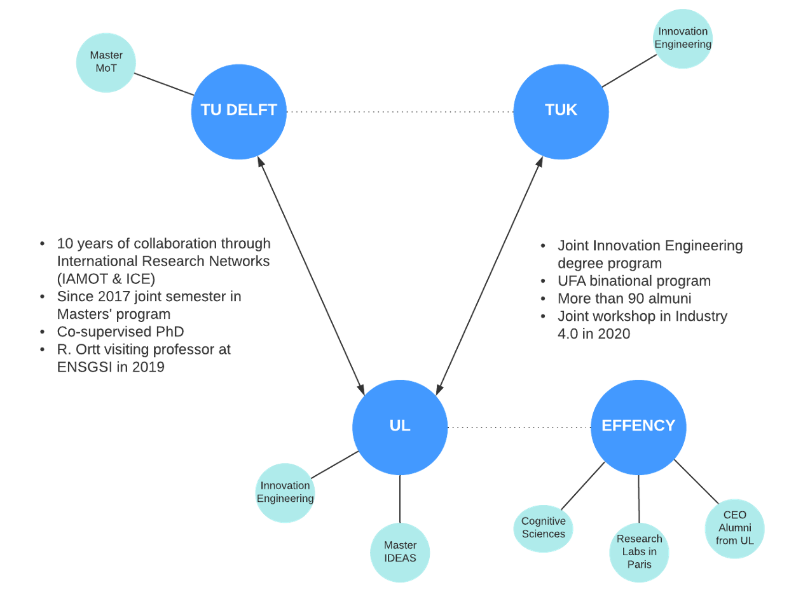
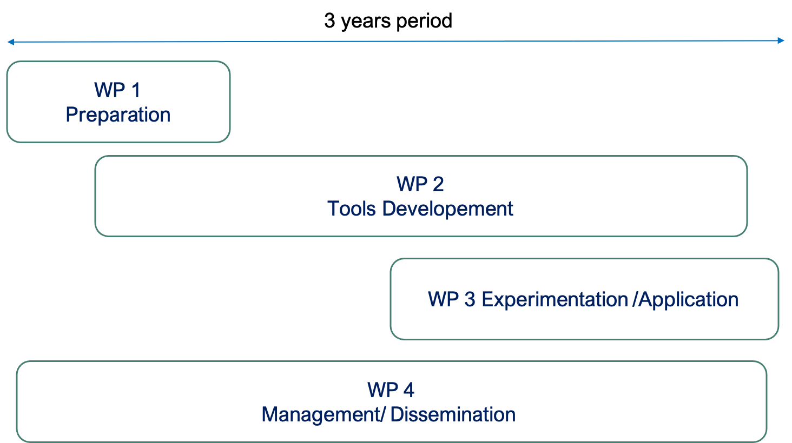

```{r share-again, echo=FALSE}
xaringanExtra::use_share_again()
```

```{r setup, include=FALSE}
options(htmltools.dir.version = FALSE)
```


class: left, middle, title-VIDAS, hide_logo


# `r rmarkdown::metadata$title`

## `r rmarkdown::metadata$subtitle`

### `r rmarkdown::metadata$author`


### Nancy, France &mdash; `r rmarkdown::metadata$date`

.footnote[Last update: `r Sys.Date()`]


---

```{r xaringan-logo, echo=FALSE}
xaringanExtra::use_logo(
  image_url = "https://erpi.univ-lorraine.fr/assets/images/logo-ERPI.svg"
)
```

# Context


-  The use of Virtual Technologies (VTs) in developing academic and business projects will be the rule.

- Team management practices differ for Virtual and distributed teams.

- There are already joined International programs:
  - .content-box-red[How to assure their continuity under the current conditions?]

- ..content-box-red[How could we make a digital empowerment of Educators and students during joint international trainings programs?]

- Support cohesion and evolution as leverage for distributed team performance. 


---

# Problem

There are currently no significant studies on the influence of Virtual Teams during the creation of the innovation project plan or on how they can be considered a key element of the plan<sup>1</sup>

- There is no dedicated tools to assure teaching modules on Innovation and MOT for distributed teams.
- How assure the learning of innovation processes under virtual / online conditions
- Virtual team for Creativty purposes

.content-box-blue[
Cooperate Vs Collaborate
]


.columns-2[
.content-box-gray[
Collaboration <br>
tools for operation/executive role 
-  Defined goals in advance --> Short term view
]
.content-box-green[
Cooperation  <br>
Tools for Innovation
- Undefined goals in advance --> Tools to build setup knowledge creation --> Long term?
]
]


.footnote[
[1]  Gallego, J.S., Ortiz-Marcos, I., Romero Ruiz, J., 2021. Main challenges during project planning when working with virtual teams. Technol. Forecast. Soc. Change 162, 120353. https://doi.org/10.1016/j.techfore.2020.120353]


---

# Goals

- Building up, test and validate a set of digital tools to guide educators and students to develop innovation and technology management teaching modules including the conformation of the group, creativity sessions, and materialization? .
- The tool consider the Personal trait psychology


---

# The (Possible) Consortium
## Based on Joint educational programs already in place

- Three Universities offering Innovation and MoT programs:

  - Université de Lorraine:  Ideas Master degree 
  - Delft University of Technology (TU Delft):  Mot Master
  - Technische Universität Kaiserslautern (TUK): Joint Innovation Engineering degree with UL  


---

# The (Possible) Consortium
## Based on Joint educational programs already in place

**UL-TUK:** 

Since 2000, the Engineering school (ENSGSI) of the  UL and the TUK  have a common engineering degree. More than 90 alumni from  both universities, has been beneficiated of this program which is awarded since its beginning by the UFA  binational program (French-German Universities Network). 

Together, a common workshop on industry 4.0 was held on 2020 has obtained the sponsoring of the UFA program.

---

# The (Possible) Consortium
## Based on Joint educational programs already in place

**UL-TU DELFT:** 

- For more than 10 years, both universities are part of the IAMOT – ICE communities  (Innovation and technology management). 

- Since 2017, a joint semester at the master’s degree level has  been implemented within the framework of the Erasmus program. 

- A co-supervised PhD has been  accomplished in 2018. 

- In 2019, Dr Ortt has been invited professor at the ENSGSI school for 1-month period.  
- A number of  joint scientific papers has been already published.  


---

# The (Possible) Consortium

**UL – EFFENCY:**

- EFFENCY is a multicultural startup based in Paris which specialises in maximising collective intelligence and efficiency. 

- They develop.content-box-yellow[blended learning tools] such as a digital coach which can be personalised and plugged into collaborative digital platforms. 

- Based on .content-box-yellow[cognitive science research], the proposition value is to .content-box-yellow[empowers individuals to accelerate quality relationship within professional and academic contexts]. 

- A coaching program is developed by professional coaches consists of theoretical concepts, practical exercises, personal and team challenges, tips and advice all of which will help them find their place within the team and to create cohesion in a more enjoyable atmosphere. The tools developed and implemented by EFFENCY will underscore the already existing network between these universities, catalyse their digital transition and facilitate interactions between students all over Europe.

CEO, Alumni from ENSGSI  

---
class: middle

# The (Possible) Consortium


.left-column[

- UL
- TU DELFT
- TUK
- EFFENCY
]
.right-column[


]


---


class: middle, left
background-image: url(figures/Consortium-01.png)
background-position: right
background-size: contain

# Project VIDAS

Sandbox: <br> 
*"a place to explore, build, develop,<br>
and re-group when everything <br>
falls apart"*


.footnote[
(McDonald et al., 2016)

]


---

# The approach
## (Based on) Current joint teaching modules

Team creation / Team Building --> Effency
2. 48h pour Innover (Distributed Creativy Challenge)
3. Digital transformation (on-line course)
4. Industrial Joint project DELFT – UL -->TEA
5. TUK -- Course
  - Management of Technology Resources (MoTR) (Brunelle) 
  - Internation project management (Davy)
  - Joint international workshop on Industry 4.0
  - Creativity (Raphael)

.content-box-green[Digital tools for each module?]


---
# Deliverables

- Educational toolkit for innovation project management in distributed teams

1. Teams creation
2. Creativity application
3. Project management tools / methodologies
  - .content-box-red[Open-source Platform? (MooC, or/and Apps)?] To support MoT in innovation process and 
4 Training documentation
5. Pilot project with DELFT and TUK


---

# Program Structure




---

class: middle, center

# Thank you

## Université de Lorraine - ERPI Laboratory

